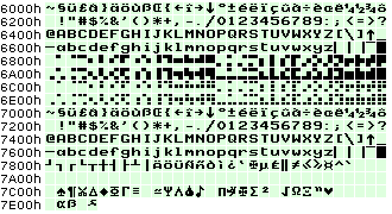

# Minitel 5

The Minitel (or *Médium interactif par numérisation d'information téléphonique* -- Interactive medium for digitized information by telephone) was a french dumb terminal with an embedded modem, widely distributed in France.
It had its Golden Age before the rise of Internet (content for it was commercially available from 1982 to 2012). They were mostly cubic with an included CRT screen and, more importantly, you could get one at home free of charge (the Model 1 was "lent" for free, as it was supposed to replace the telephone directory --the White Pages-- which were still in the form of a book at the time).
It was a huge success and a lot of people (including me) had their first experience with telematic playing with that thing.

The Minitel 5, a later version made during the early '90s, was not easy to find in the wild. It was flat, with an LCD screen and contained a battery. This "laptop-style" terminal could be used in phone booths and cars.

I've got one, but [it is very strangely crashing at the second key press](https://www.youtube.com/watch?v=lb3u2duY9KQ).  
As there seems to be no documentation yet available for it, I made this git repository.

## EPROM Dumps

There are two 27C256 EPROM on the Minitel 5 board.

The first is the main EPROM, in socket `MN3`, containing all the firmware as the 80C32 microcontroller is ROMless. Beware, as my Minitel 5 is crashing, this ROM **may** be corrupted. If somebody can dump their own device, it could be very interesting for me to compare.

[Link to the first dump file](dumps/minitel5_main_eprom.bin)

The second EPROM, in socket `MN8`, is connected to the character generation IC and contains solely the bitmap font. 485 '16-bytes' zones from 0x6000 to 0x7E5F, with only the first 10 bytes used in each block (the 6 extra are always 0x00), one byte for each line of each character, where each bit is a pixel. Everything before address 0x6000 and from 0x7E50 to the end is filled with 0xFF.

[Link to the second dump file](dumps/minitel5_character_generator_eprom.bin)

## Integrated circuits

* `MN1` MHS 80C32 (MCU)
* `MN2` MHS MBSR-2000F11-5 DECOPLAT-1
* `MN3` NEC D27C256AD-15 (main EPROM)
* `MN4` Sharp LH5164-10 (backup RAM)
* `MN5` ROM/RAM "dual-dual row" (empty socket)
* `MN6` OKI M6255 (dot matrix lcd controller)
* `MN7` MHS MBSM-2000F05-5 VIDEOPLAT-1)
* `MN8` NEC D27C256AD-15 (bitmap font EPROM)
* `MN9` Philips FCB61C65LL-70T (SRAM)
* `MN10` Philips FCB61C65LL-70T (SRAM)
* `MN11` Motorola HC245A (3–state octal latch)
* `MN12` Motorola HC245A (3–state octal latch)
* `MN13` Motorola HC00A (quad 2-input NAND gate)
* `MN14` Harris HC04 (hex inverter)
* `MN15` Motorola HC245A (3–state octal latch)
* `MN16` Motorola HC245A (3–state octal latch)
* `MN18` Motorola HC4075 (triple 3-input OR gate)
* `MN19` RCA(?) HC273 (octal D latch w/common clock and reset)
* `MN201` ST TSB7513CP (single chip asynchronous FSK modem)
* `MN202` Philips PC74HC4053T (triple 2-channel analog multiplexer/demultiplexer)
* `MN203` TI(?) 27M4C (quad low power CMOS op-amp)
* `MN204` ST EFG71891PD (DTMF generator w/serial input)
* `MN205` Harris HC4052 (dual 4-channel analog multiplexer/demultiplexer)
* `MA103` LM3578N (DIP-8 switching regulator)
* `MA104` ADC0831CCN (single differential input 8-bit ADC w/serial I/O)
* `MA201`, `MA202`, `MA203` Harris H11AG2 (phototransistor optocouplers)

## More to come!

I already have some schematics. But i'm already now fucking tired doing this! :x

## Acknowledgements

People I wishes to thanks:

* **Ghyom** for giving me that ancient device
* **Furrtek** for his help for recognising Harris old IC logo and the 27M4C op-amp
* **Fréderic** from *CEM de Ronchin* for his help in desoldering `MN8`
